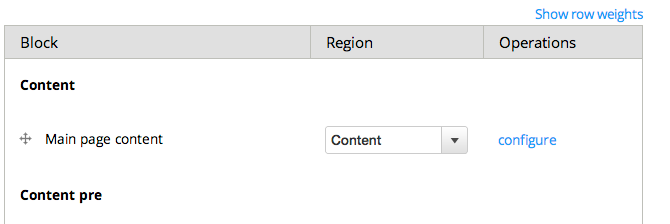

# Initiation a Drupal
## slides
Les slides de la présentation sont disponible à cet url

[bit.ly/drupalini](bit.ly/drupalini)

[initiation-a-drupal.pdf](initiation-a-drupal.pdf)


## Agenda
- Drush
- Module et hook
- API


## Drush


### Drupal shell

Drush c'est le drupal shell, c'est l'outil en ligne de commande de drupal.


[Documentation | drush.org](http://www.drush.org/en/master/)


### Project manager

Drush contiens un projet manager, qui peut télécharger et mettre à jours le core
de drupal, les thèmes et les modules.


```bash
$ cd ~/Sites
$ drush pm-download
Project drupal (7.34) downloaded to /Users/dl/Sites/drupal-7.34
```


### Installation

Drush permet d'installer drupal, ce qui créé ou écrase la base de données et les 
fichier de configuration.


```bash
$ cd /Users/dl/Sites/drupal-7.34
$ drush site-install standard \

my-template-name.tpl.php
```php
  <h1><?php print $title ?></h1>
```
```


### Mise à jours

On peut faire les mises à jour du code des modules et du core ainsi que la base 
de données par drush.


```bash
$ drush pm-updatecode
No code updates available.

$ drush updatedb
No database updates required
```


### Variables

Drush permet d'inspecter et de modifier les variables de drupal.
```bash
$ drush variable-get name

$ drush variable-set site_name new-name
site_name was set to "new-name".
```

### script

On peut utiliser drush pour executer des scripts php ce qui est pratique pour 
explorer l'api.


```bash
$ echo "<?php var_dump(menu_tree_page_data('main-menu'));" \
  > test.php
$ drush php-script test.php
 array(1) {
   '50000 Home 218' =>
   [...]
```


### Gestion des modules

On peut aussi gérer les téléchargements, installations et mise à jour des modules

Avec la commande suivante on télécharge le projet example de drupal. Ce sont des
exemples de module pour apprendre à travailler avec les api backend de drupal.


```bash
$ drush pm-download example
Project examples (7.x-1.x-dev) downloaded to sites/all/modules/examples.
```

[Examples for Developers | drupal.org](https://www.drupal.org/project/examples)

## block_example

Nous allons étudier le module 'block_example' qui démontre comment créer un block custom.

Au minimum un module contiens un fichier de configuration block_example.info et 
un fichier avec le code block_example.module.

Le fichier block_example.install contiens le script d'installation et le block_example.test
contiens les tests d'intégration drupal avec Simple Test.

```console
$ cd sites/all/modules/examples/block_example
$ ls
block_example.info
block_example.install
block_example.module
block_example.test
```


### block_example.info
Le fichier info contiens l'information du module qui seront affiché dans 
l'interface d'administration ou dans la commande `drush pm-info`.

```
name = Block Example
description = An example outlining how a module can define blocks.
package = Example modules
core = 7.x
```


### HOOK_block_info

Dans le fichier .module on définie des hook pour que drupal puisse appeler notre 
code. Les hook sont des fonction qui débute avec le nom du module.

Par exemple pour implémenter hook_block_info on définie une fonction avec le nom
block_example_block_info().

```php
/**
 * Implements hook_block_info().
 *
 * This hook declares what blocks are provided by the module.
 */
  function block_example_block_info() {
```


### HOOK_block_info
Le hook block_info on retourne les informations de notre block à drupal.

```php
  $blocks['example_uppercase'] = array(
    'info' => t('Example: uppercase this please'),
    'status' => TRUE,
    'region' => 'sidebar_first',
  );
  return $blocks;
 }
```


### documentation

Les valeurs possible de l'array de block est documenté sur le site de drupal.org

Et on as la listes des hook disponibles sur le lien suivant.

[hook_block_info | drupal.org](https://api.drupal.org/api/drupal/modules%21block%21block.api.php/function/hook_block_info/7)

[hooks | drupal.org](https://api.drupal.org/api/drupal/includes%21module.inc/group/hooks/7)


example.local/admin/structure/block
Lorsque drupal as les informations du block, on peut l'assigner à une région dans 
l'interface administrateur.




### hook_block_view

Le hook block view est appelé par drupal avant d'afficher les block et le machine
name du block est passé en argument.

```php
function block_example_block_view($delta = '') {
  switch ($delta) {
    case 'example_configurable_text':
```

### example_empty

On as simplement à ajouter la string qu'on veux afficher comme valeur à 
la clé 'content' pour qu'elle s'affiche dans le block.
```php
    case 'example_empty':
      $block['subject'] = t('Title of second block');
      $block['content'] = block_example_contents($delta);
    break;
```


## hook_menu

Les routes dans drupal sont déclaré en utilisant le hook menu. Ça porte à confusion 
au début mais pour les développeur drupal un menu ce n'est pas un menu c'est une 
route, le path pour accéder à une page custom.

Nous allons regarder les exemples fournis par drupal.


```bash
$cd ~/Sites/drupal-7.34/sites/all/modules/examples/menu_example

$ls
menu_example.info   menu_example.module menu_example.test
```


### menu_example.module

Dans le fichier menu_example.module on définit le hook_menu que nous allons 
utiliser pour retourner les informations sur nos routes à drupal.

```php
/**
 * Implements hook_menu().
 *
 * A simple example which defines a page callback and a menu entry.
 */
function menu_example_menu() {
```


example.local/examples/menu_example

Si on veux ajouter la route examples/menu_example à notre projet
on ajoute la route comme clé à l'array que retourne le hook
on déclare une fonction callback et une validation d'accès.

En retournant 'TRUE' on s'assure que tout les rôles ont accès
à notre page.

```php
function menu_example_menu() {
 $items['examples/menu_example'] = array(
   'page callback' => '_menu_example_basic_instructions',
    'access callback' => TRUE,
    );
  return $items;
}
```


### Callback

La fonction callback définie dans le hook_menu retourne le markup à afficher sur
dans le contenu de la route.

Voici la documentation du hook menu et celle du hook_i18n_translate_path qui
est pratique pour associer les routes des différentes langues pour que drupal
puisse construire le language switcher.

```php
function _menu_example_basic_instructions($content = NULL) {
  $base_content = t(
  'This is the base page of the Menu Example. There are a number of examples
  here, from the most basic (like this one) to extravagant mappings of loaded
  placeholder arguments. Enjoy!');
  return '<div>' . $base_content . '</div><br /><div>' . $content . '</div>';
```


### Documentation hook_menu

[ hook_menu | drupal.org ](https://api.drupal.org/api/drupal/modules%21system%21system.api.php/function/hook_menu/7)

[ hook_i18n_translate_path | drupalcontrib.org ](http://drupalcontrib.org/api/drupal/contributions!i18n!i18n.api.php/function/hook_i18n_translate_path/7)


## hook_theme

### my_example.module
Le module theming_example.module démontre différent exemples d'utilisation du 
hook_theme. Souvent on l'utilise simplement pour créer un template custom dans un 
module.

On n'as qu'à retourner la clé de notre thème et le nom du fichier template au hook.

```php
function my_example_theme() {
  return [
    'my_theme_key' => [
      'template' => 'my-template-name'
    ]
  ];
}
```


### template files

Dans notre exemple on déclare un fichier template
my-template-name.tpl.php
```php
  <h1><?php print $title ?></h1>
```

### theme( $key, $variables )
Puis lorsqu'on utilise cette clé dans la fonction thème ça nous retourne une 
chaine de caractère contenant le markup du fichier template my-template-name.tpl.php

Par exemple ici on utilise notre template dans un callback de menu pour l'afficher
sur une page.

```php
  function _menu_callback() {
    return theme('my_theme_key',['title'=> "variable value"]);
  }
```

Le deuxième argument de la fonciton thème contiens les variables du template
et les clés seront les noms des variables.


## hook_preprocess_hook

### html.tpl.php
En déclarant le hook_preprocess_hook un modules peut modifier les variables que
drupal passe à un template.

Comme premier exemple le html.tpl.php est le premier template de drupal, il
contiens par exemple la balise <head> ou on aimerais ajouter l'id de Google 
Analytics

```php
function my_example_preprocess_html( &$variables ) {
    $variables['googe_analytics_id'] = "1234543";
  }
```


###page.tpl.php

Le template page.tpl.php contiens le layout général du site, les régions, 
les menus, le header, le footer. Dans cette exemple on définie une nouvelle
variable $header qui contiens le markup de notre fonction _get_custom_header()

```php
function my_example_preprocess_page( &$variables ) {
    $variables['header'] = _get_custom_header();
  }
```


On as aussi un preprocess pour les templates de nodes et on as le type de contenu
dans l'array de variable pour agir sur les nodes d'un type de contenu spécifique.

```php
function my_example_preprocess_node( &$var ) {
  if ($var['type'] == 'my_content_type'){
    $var['my_variables'] = _my_processing($var['node']);
  }
}

```


## Variable

Drupal as un array de variable "persistante" qui est enregistré dans la base de 
donnés.

On peut utiliser la fonciton variable_get() avec la clé de la variable pour obtenir
sa valeur.


```php
  $variables['googe_analytics_id'] = variable_get('my_ga_id');
```


### variable.module

il y as un module nommé variable qui permet de déclarer des page de configuration 
dans l'interface administrateur de drupal pour les variables.

```bash
$drush dl variable
Project variable (7.x-2.5) downloaded to sites/all/modules/variable.                                                      [success]
Project variable contains 6 modules: variable_views, variable_store, variable_realm, variable_example, variable_admin, variable.
$ cd ~/sites/drupal-7.34/sites/all/modules/variable/variable_example
```


### hook_variable_info
Pour obtenir une page de configuration pour notre variable on premièrement le 
hook_variable_info pour configurer les métadonnées de notre variable et on 
l'associe à un groupe de variable.

```php
//variable_example.variable.inc
function variable_example_variable_info($options) {
 $variables['variable_example_text'] = array(
    'type' => 'text',
    'title' => t('Simple text', array(), $options),
#   [...]
   'group' => 'variable_example',
```


### hook_variable_group_info

Ensuite on déclare les informations du groupe de variable qu'on vas
afficher sur notre page de configuration et on l'associe à un 
path.

```php
function variable_example_variable_group_info() { 
 $groups['variable_example'] = array( 
    'title' => t('Examples'), 
    'description' => t('Variable examples of different types.'), 
    'access' => 'administer site configuration', 
   'path' => array('admin/config/system/variable/example'),
```


### 
Finalement on déclare la route custom pour la page d'administration de 
notre group de variables.

On ajoute le callback drupal_get_form et le groupe de notre variable aux arguments
de cette route.
```php
//variable_example.module
function variable_example_menu() {
    'path' => array('admin/config/system/variable/example'),
    'title' => 'Variable example',
    'description' => 'Example of auto generated settings form.',
   'page callback' => 'drupal_get_form',
   'page arguments' => array('variable_group_form', 'variable_example'),
    'access arguments' => array('administer site configuration'),
  );
```

## EntityFieldQuery

Les nodes et les users sont des entitées et l'objet EntityFieldQuery permet
de faire des requêtes qui retourne ces entités.
### node de type custom_type

```php
    $query = new \EntityFieldQuery();
    $query->entityCondition('entity_type', 'node')
      ->entityCondition('bundle','custom_type')
      ->propertyCondition('status', 1)
      ->propertyCondition('language', 'fr');
```

### node_load

```php
    $queryResult = $query->execute();
    $nodeArray = isset($queryResult['node'])? $queryResult['node']:array();
    $nodesId = array_keys($nodeArray);
    $nodes=  node_load_multiple($nodesId);
```


### documentation
[How to use EntityFieldQuery | drupal.org](https://www.drupal.org/node/1343708)


## Entity Metadata

Le entity metadata wrapper permet de faciliter la manipulation des nodes en php.

Sans le Entity metadata accéder aux valeurs des field est un peu complexe. 
Il faut utiliser la clé de la langue et celle de l'index, même si c'est
un champ à valeur unique dans un type de contenu non traduit.
```php
  $value = $node->field_number[LANGUAGE_NONE][0]['value'] 
```

### getter
Lorsqu'on ajoute le wrapper à une node on peut simplement appeler 
le getter sur le field et le wrapper d'occupe de la langue courante
et de nous retourner une valeur unique ou un array selon le cas.

```php
  $wrapper = entity_metadata_wrapper('node', $node);
  $value = $wrapper->field_number->value(); 
```
### setter
On as aussi accès à un setter.

```php
  $node_wrapper->field_number->set(1); 
```

### property information
Le wrapper ne contiens aucunes valeurs, pour avoir la liste des fields et autres
propriétés d'une entity on peux utiliser la méthode getPropertyInfo

```php
  var_dump($wrapper->getPropertyInfo());
```


## theme


### Mothership

Drupal est à la base un projet porté par une communauté de développeur backend.
On entend rarement des développeurs front end vanter les bon coté du système de
template de drupal et les critiques sont plus que fréquentes.

L'ambition de mothership est d'offrir des solutions à certaines de ces critiques.

> "If you really like the markup & CSS options that Drupal provides - this theme is probably not for you"
-[Mothership](https://www.drupal.org/project/mothership)


drush dl mothership
drush cc all

drush |grep  mothership
Other commands: (make,mothership)
 mothership            Create a mothership sub-theme.
 drush mothership test
 Mothership subtheme "test" created in: /Users/dl/Sites/drupal-7.34/sites/all/themes/test
 Visit your themes settings page and configure it to your liking: http://default/admin/appearance/settings/test
## Système de région
    créer une nouvelle région
   Associer un block à une région
## Système d'ouverride de template dans drupal


Modication de la portion backend
## Gestions des librairies et autoloader (composer)
## Exemples de code et test automatisé (phpspec)
## Traitement des variables des éléments de conteu
    Drupal adapter
   Arrays functions
    Fields functions
   Menu


## Création d'un type de content
## Utilisation du module field collection
## Gestion des menus
Utilisation de git et release cycle
## Fonction des différentes branches
## Fonction des différents Environnements
## Déploiement du code et mise à jours de la configuration

Gestion de la configurations et mise à jours automatisé

## Configuration drupal par script automatisés
     fichier.install
    hook_update_n
 ## gestion des variables et des modules
 ## gestion des roles et permissions
 ## Export de la configuration par features
 ## Module d'intégration
